# DataLake-ADD

  El siguiente proyecto muestra la cosecha y el analisis de los datos NoSQL y SQL. 
  
   **Video demostrativo:** 
   
   **Realizado por:**
   
    -Mateo Vera
    -Kevin Veliz
    -Lizbeth García
    -Kevin Pulupa
    
# Arquitectura DataLake
  Para dar a inicio nuestro proyecto plantemos esta arquitectura para poder extraer los datos SQL y NoSQL, dando asi el analisis respectivo y el almacenamiento de cada uno de estos datos.
  
  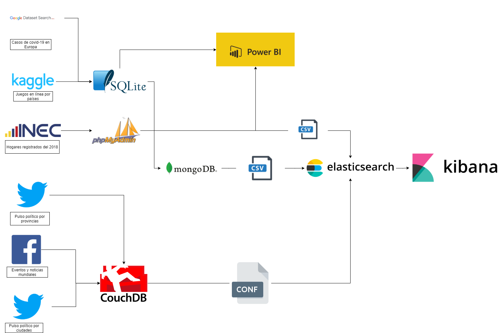
    
# 1. Cosechas

  **SQL**
     Para la practica usamos 3 bases de datos estaticas estas bases son INEC intituto Nacionad de Estadisticas y Censos en los cuales se pudo sacar datos importantes para la practica estos datos son entrevistas a las familias se saco valores como la "Cantidad de dormitorios", "Servicio a internet", "Con un computador", "Hombres" y "Mujeres".
     Para las otras dos bases de datos utilizamos la pagina GoogleSet Search donde nos permitio encontrar las dos ultimas bases de datos estaticas "Online Games" y "Covid-19".
     
 **NoSQL**
    Para la extracion de los datos NoSQL utilizamos SCRIPTS que nos permiten sacar datos de diferentes plataformas de manera sencilla y con conexion a bases de datos para estas cosechas de datos nos centramos en las plataformas "FB", "Twitter" en los cuales se extrayeron tres datos "Pulso politico por provincias", "Eventos y noticias mundiales" y "Pulso politico por cuidades".
 
 # 2. Transformación de datos
 
 Al momento de realizar la cosecha de datos NoSQL no se transformaron mediante el mismo script se mandan a la base de datos.
 
 **Datos SQL**
 Al momento de realizar la cosecha y la implementacion de la base de los archivos "Online Games" y "Covid-19" no se realizo ninguna transformacion de datos.
 
 Para la implementacion de los datos descargados del INEC se realizo una transformacion de datos:
 
 **1. La limpieza de datos en el csv***
 Una ves descargados los datos del INEC se tiene que hacer una limpieza manual dentro del archivo csv donde elejimos los datos que queremos utilizar y necesitamos para el analisis de estos datos en el caso de la practica en el mismo archivo.zip que se descarga nos dan los datos de cada una de los csv que nostros vamos a utilizar.
  
  **Datos Pichincha**
Son los datos que se van a utilizar para el analisis de los datos estos archivos son "csv" y "xls" cada uno para su respectiva funcionalidad.
 
 
  **Datos Guayas**
Son los datos de la provincia de guayas de la misma manera archivos "csv" y "xls".
 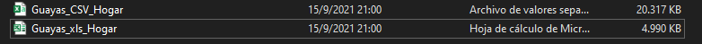
    
    
 Una ves los datos que se tengan son los que necesitamos procederemos a guardar los datos como "xls" esto es para facilitar la transformacion eh implemtacion de los datos mediante RapidMiner, utilizamos el lector de archivos EXCEL para poder leer el "xls" y tranformalo a CSV con el "Write CSV" esto es porque el phpmyadmin adimte datos "csv" no "xls", para el manejo correcto de la conexion con la base de datos necesitamos levantar el servidor XAMP para poder crear una cuenta dentro de phpmyadmin en el cual debemos tener todos los servicios y crear una base de datos.
 
 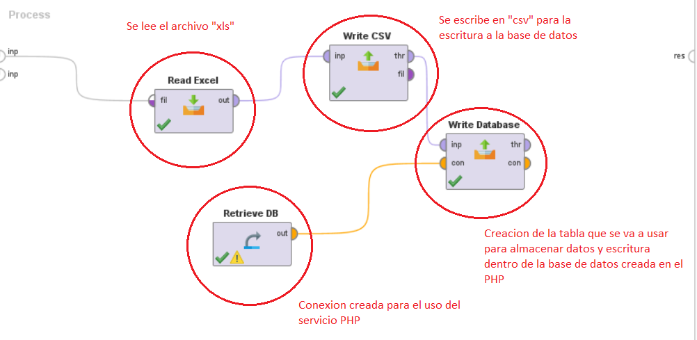
 
 Una ves realizada la conexion procedemos a utilizar el write database para poder crear una tabla donde se almacenen todos los datos que vamos a subir como estos datos INEC tienen una gran cantidad de datos se dividio estos datos en dos provincias las mas grandes del pais "Guayas y Pichincha" para tener una recolecion mas rapida, adicional se creo un csv con 30000 datos de cada canton "Guayaquil y Quito" para facilitarnos el analisis de los datos con estos datos se suben al phpMyadmin.
 
 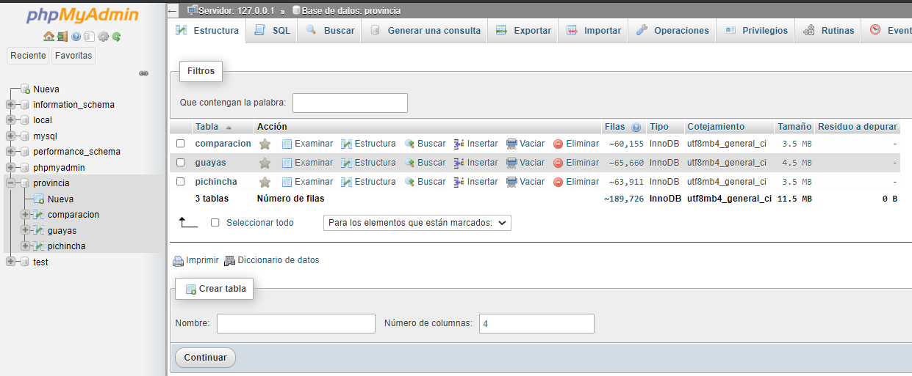

Una ves los datos estan en la base de datos exportamos los datos en forma de "csv" arreglando errores y corregiendo fallas para poder leer en logstash y subir a Elastic Search.

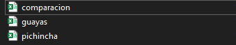

 # 3. Creacion de indices 
 
 Para la creacion de los indices se utilizaron diferentes medios entre los cuales tenemos: 

  **1. Kibana**
    Se subieron los datos csv antes mencionalos estos datos son "ONLINE GAMES", "Covid-19" y los datos exportados de phpMyadmin "Pichincha.csv", "Guayas.csv" y "Comparacion.csv" cada uno de estos datos se subio a kibana de manera manual.
    
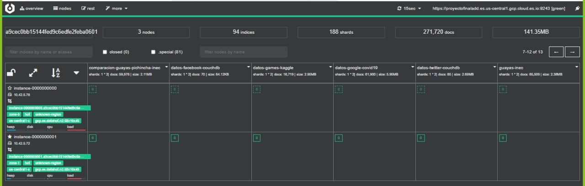
.jpeg)  

 **2. Linea de Comandos**
 Los datos NoSQL se crearon los indices mediante la linea de comando, desde los scripts se realizo una conexion a couchdb y con el uso de los archivos de configuracion se pueden subir los datos a ElasticSearch de manera facil y sencilla. 
 
 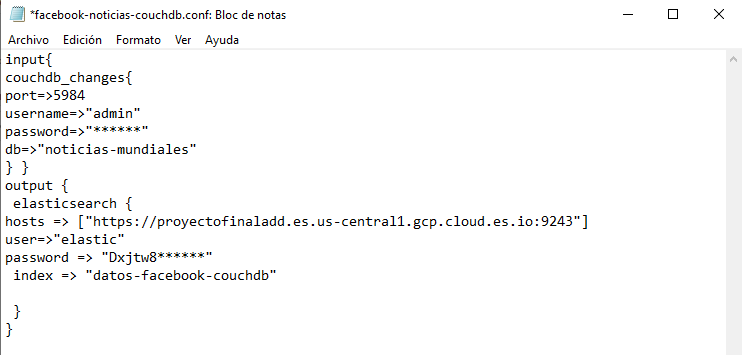
 
 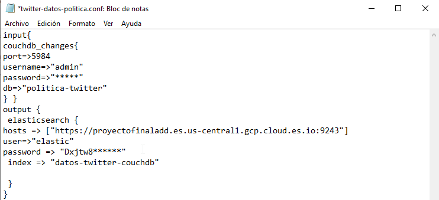
  
  
 De esta menera se crearon los indices que tenemos disponibles dentro de ElasticSearch.
 
 # 4. Creación de mapping
  **Herramienta ElasticSearch**
   Una ves tengamos los indices de los datos dentro de nuestro datalake "ElasticSearch" realizamos el mapping de las base de datos por cada una de las bases ingresadas.
    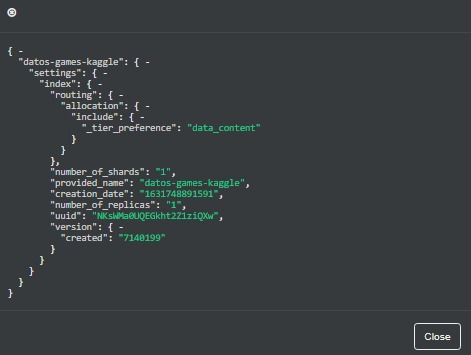.
    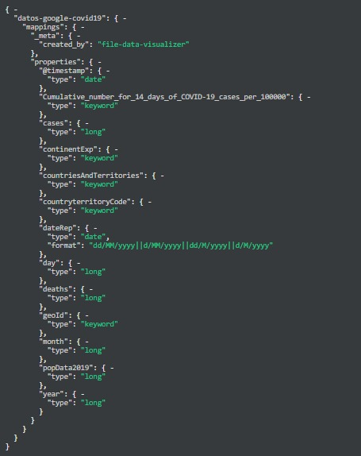
    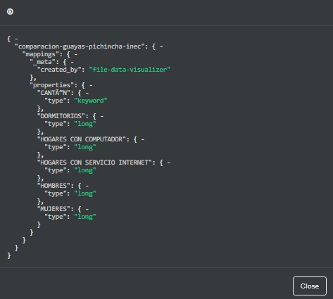
    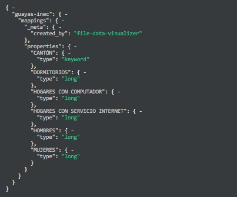
    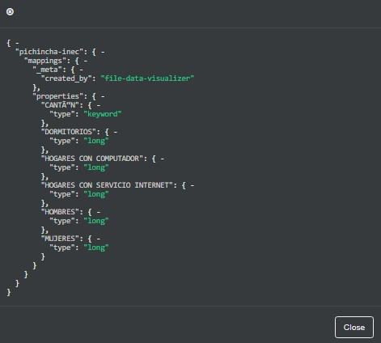
    Mapping NoSQL
   **NoSQL**
    Mapping datos
    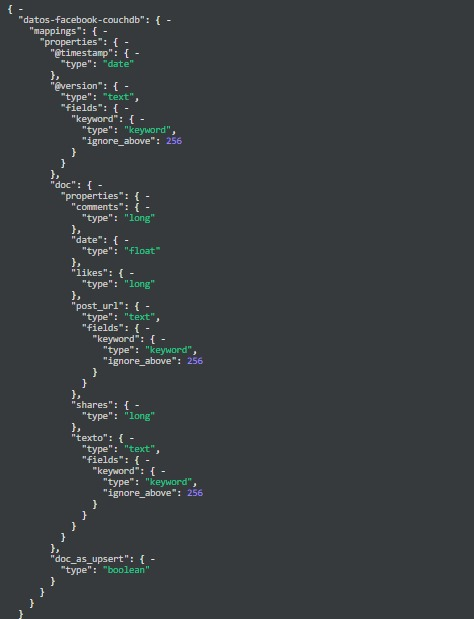
    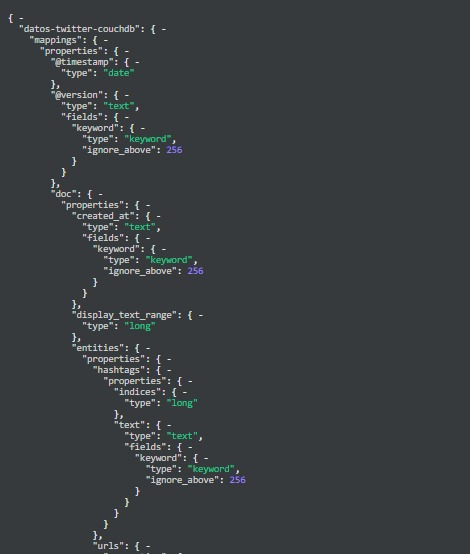
   
 # 5. Cruser
 
  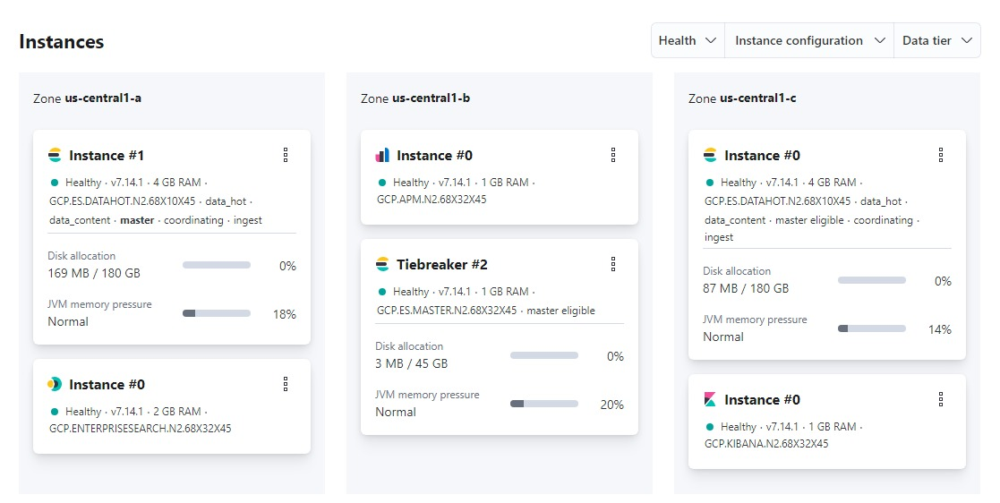
 
 # 6. Anexos
 
 
 En el siguiente enlace se halla los datos estaticos y los  scripts ubicados en un archivo.rar: 
 
 Datos SQL y NoSQL
 
  https://github.com/Chriss78Vera/DataLake-ADD
    
